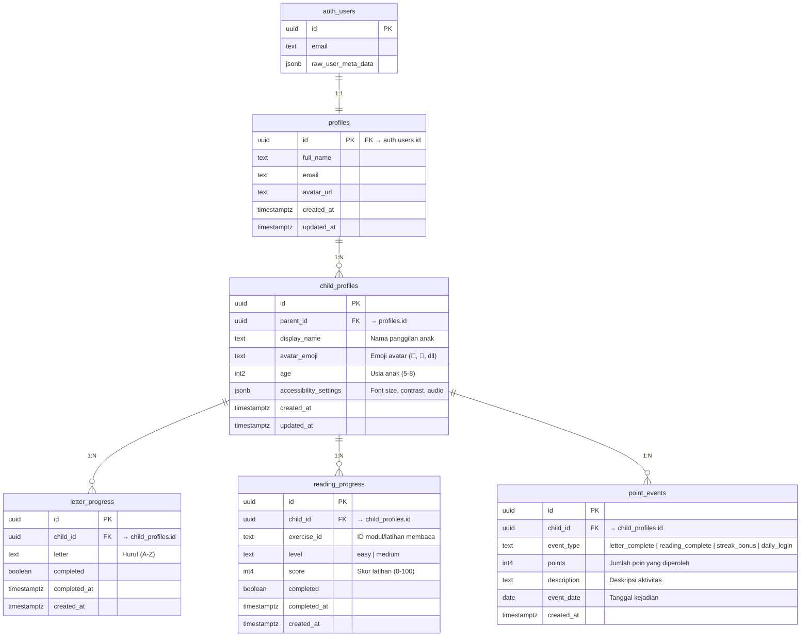

# 📊 Database Schema — Lentera Baca V2

## Overview

Lentera Baca V2 menggunakan **Supabase (PostgreSQL)** sebagai backend database. Autentikasi menggunakan **Supabase Auth** dengan provider **Google OAuth**. Semua tabel dilindungi oleh **Row Level Security (RLS)** untuk memastikan privasi data anak.

## Entity Relationship Diagram

## Tabel Detail

### 1. `profiles`
Menyimpan data profil orang tua/pendamping. Terhubung 1:1 dengan `auth.users` (Supabase Auth).

| Kolom | Tipe | Constraint | Keterangan |
|---|---|---|---|
| `id` | `uuid` | PK, FK → `auth.users.id` | ID sama dengan auth user |
| `full_name` | `text` | | Nama lengkap dari Google |
| `email` | `text` | | Email dari Google |
| `avatar_url` | `text` | | URL foto profil Google |
| `created_at` | `timestamptz` | NOT NULL, DEFAULT now() | Waktu pembuatan |
| `updated_at` | `timestamptz` | NOT NULL, DEFAULT now() | Waktu terakhir diperbarui |

### 2. `child_profiles`
Menyimpan data profil anak. Satu orang tua bisa memiliki banyak profil anak.

| Kolom | Tipe | Constraint | Keterangan |
|---|---|---|---|
| `id` | `uuid` | PK, DEFAULT gen_random_uuid() | ID unik anak |
| `parent_id` | `uuid` | FK → `profiles.id`, NOT NULL | ID orang tua |
| `display_name` | `text` | NOT NULL | Nama panggilan anak |
| `avatar_emoji` | `text` | DEFAULT '🦁' | Emoji avatar anak |
| `age` | `smallint` | CHECK (age >= 3 AND age <= 12) | Usia anak |
| `accessibility_settings` | `jsonb` | DEFAULT (lihat migration) | Pengaturan aksesibilitas |
| `created_at` | `timestamptz` | NOT NULL, DEFAULT now() | Waktu pembuatan |
| `updated_at` | `timestamptz` | NOT NULL, DEFAULT now() | Waktu terakhir diperbarui |

### 3. `letter_progress`
Tracking huruf yang sudah dipelajari per anak.

| Kolom | Tipe | Constraint | Keterangan |
|---|---|---|---|
| `id` | `uuid` | PK, DEFAULT gen_random_uuid() | |
| `child_id` | `uuid` | FK → `child_profiles.id`, NOT NULL | |
| `letter` | `text` | NOT NULL | Huruf yang dipelajari (A-Z) |
| `completed` | `boolean` | DEFAULT false | Sudah dikuasai? |
| `completed_at` | `timestamptz` | | Waktu selesai |
| `created_at` | `timestamptz` | NOT NULL, DEFAULT now() | |

**Unique Constraint**: `(child_id, letter)` — satu anak hanya punya 1 record per huruf.

### 4. `reading_progress`
Tracking modul latihan membaca per anak.

| Kolom | Tipe | Constraint | Keterangan |
|---|---|---|---|
| `id` | `uuid` | PK, DEFAULT gen_random_uuid() | |
| `child_id` | `uuid` | FK → `child_profiles.id`, NOT NULL | |
| `exercise_id` | `text` | NOT NULL | ID latihan membaca |
| `level` | `text` | DEFAULT 'easy' | Tingkat kesulitan |
| `score` | `integer` | DEFAULT 0 | Skor (0-100) |
| `completed` | `boolean` | DEFAULT false | Sudah selesai? |
| `completed_at` | `timestamptz` | | Waktu selesai |
| `created_at` | `timestamptz` | NOT NULL, DEFAULT now() | |

**Unique Constraint**: `(child_id, exercise_id)` — satu anak hanya punya 1 record per latihan.

### 5. `point_events`
Log poin yang didapatkan anak (streak, penyelesaian huruf, dll).

| Kolom | Tipe | Constraint | Keterangan |
|---|---|---|---|
| `id` | `uuid` | PK, DEFAULT gen_random_uuid() | |
| `child_id` | `uuid` | FK → `child_profiles.id`, NOT NULL | |
| `event_type` | `text` | NOT NULL | Jenis event |
| `points` | `integer` | NOT NULL, DEFAULT 0 | Jumlah poin |
| `description` | `text` | | Deskripsi aktivitas |
| `event_date` | `date` | NOT NULL, DEFAULT CURRENT_DATE | Tanggal kejadian |
| `created_at` | `timestamptz` | NOT NULL, DEFAULT now() | |

**Event Types**: `letter_complete`, `reading_complete`, `streak_bonus`, `daily_login`

## Row Level Security (RLS)

Semua tabel mengaktifkan RLS. Kebijakan utama:

| Tabel | Policy | Aturan |
|---|---|---|
| `profiles` | SELECT / UPDATE own profile | `auth.uid() = id` |
| `child_profiles` | ALL own children | `auth.uid() = parent_id` |
| `letter_progress` | ALL via child ownership | child harus milik `auth.uid()` |
| `reading_progress` | ALL via child ownership | child harus milik `auth.uid()` |
| `point_events` | ALL via child ownership | child harus milik `auth.uid()` |

## Indeks

| Tabel | Indeks | Kolom |
|---|---|---|
| `child_profiles` | `idx_child_profiles_parent_id` | `parent_id` |
| `letter_progress` | `idx_letter_progress_child_id` | `child_id` |
| `reading_progress` | `idx_reading_progress_child_id` | `child_id` |
| `point_events` | `idx_point_events_child_id` | `child_id` |
| `point_events` | `idx_point_events_event_date` | `event_date` |

## Trigger

- **`handle_new_user()`**: Otomatis membuat record di `profiles` saat user baru mendaftar via Google OAuth.
- **`handle_updated_at()`**: Otomatis memperbarui kolom `updated_at` setiap kali record di-update.
